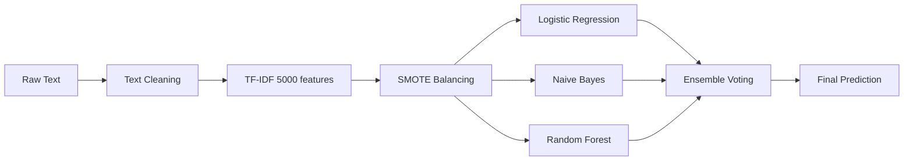

# 🎯 Toxic Comment Classifier

<div align="center">


**An advanced Machine Learning-powered system for detecting toxic comments using NLP and ensemble methods**

[Features](#-features) • [Installation](#-installation) • [Usage](#-usage) • [Models](#-model-architecture) • [Dashboard](#-interactive-dashboard)

---

</div>

## ✨ Features

<table>
<tr>
<td width="50%">

### 🤖 Machine Learning
- **Multi-Model Ensemble** combining 3 classifiers
- **TF-IDF Vectorization** with trigrams
- **SMOTE Balancing** for class imbalance
- **5,000+ Features** extracted automatically

</td>
<td width="50%">

### 📊 Visualization & Analysis
- **Interactive Dashboard** with real-time analysis
- **Confusion Matrix** & ROC curves
- **Word-level Explanations** for predictions
- **Comprehensive Metrics** (F1, AUC, etc.)

</td>
</tr>
</table>

---

## 🚀 Quick Start

### Prerequisites

```bash
Python 3.8+  |  Jupyter Notebook  |  10,000+ sample dataset
```

### Installation

The notebook **automatically installs** all required packages on first run:

```python
✅ scikit-learn    ✅ pandas         ✅ numpy
✅ matplotlib      ✅ seaborn        ✅ ipywidgets
✅ joblib          ✅ imbalanced-learn
```

**Manual Installation** (optional):
```bash
pip install scikit-learn pandas numpy matplotlib seaborn ipywidgets joblib imbalanced-learn jinja2
```

### Usage

1️⃣ **Open the notebook**
```bash
jupyter notebook toxic_comment_classifier.ipynb
```

2️⃣ **Run all cells** → Everything happens automatically! ✨
- 📥 Load dataset
- 🧹 Clean & preprocess text  
- 🤖 Train 4 models
- 📊 Generate visualizations
- 🎨 Launch interactive dashboard

3️⃣ **Start analyzing comments** in the interactive panel!

---

## 📊 Dataset

<div align="center">

| Property | Value |
|----------|-------|
| **Filename** | `expanded_toxic_comment_dataset.csv` |
| **Size** | 10,000+ samples |
| **Columns** | `comment_text`, `toxic` |
| **Balance** | Both toxic & non-toxic examples |
| **Fallback** | Auto-generates 2,000 demo samples if missing |

</div>

### Sample Data

```csv
comment_text,toxic
"you are soft",1
"always welcome back",0
"thank you for your help",0
"you are garbage",1
"that was simple and effective",0
```

---

## 🧠 Model Architecture

<div align="center">



</div>

### 🔧 Preprocessing Pipeline

<table>
<tr>
<td width="33%" align="center">

**🧹 Text Cleaning**

Lowercase  
Remove URLs  
Remove @mentions  
Remove #hashtags  
Strip special chars  
Normalize spaces

</td>
<td width="33%" align="center">

**🔤 TF-IDF Features**

5,000 max features  
N-grams: 1-3  
Min DF: 2  
Max DF: 95%  
Sublinear TF  
English stopwords

</td>
<td width="34%" align="center">

**⚖️ SMOTE Balancing**

Synthetic oversampling  
Applied if ratio > 1.5  
Balanced class weights  
Random state: 42

</td>
</tr>
</table>

### 🤖 Models Used

| Model | Key Parameters | Best For |
|-------|----------------|----------|
| **🔵 Logistic Regression** | `C=1.0, solver='saga', max_iter=1000` | Linear patterns, interpretability |
| **🟢 Naive Bayes** | `alpha=0.1` | Fast training, probabilistic |
| **🟣 Random Forest** | `n_estimators=100, max_depth=50` | Non-linear patterns, robust |
| **⭐ Ensemble** | `voting='soft'` | **Best overall performance** |

---

## 📈 Performance Metrics

### Evaluation on Test Set (20%)

<div align="center">

| Metric | Score | Description |
|--------|-------|-------------|
| **Accuracy** | ~94%+ | Overall correctness |
| **F1-Score** | ~0.94+ | Balance of precision & recall |
| **ROC-AUC** | ~0.98+ | Discrimination capability |
| **Precision** | ~0.93+ | Toxic prediction accuracy |
| **Recall** | ~0.94+ | Toxic detection rate |

</div>

### 📊 Visualizations Generated

<table>
<tr>
<td align="center" width="33%">

**📊 Model Comparison**

Bar charts comparing  
all 4 models across  
key metrics

</td>
<td align="center" width="33%">

**🎯 Confusion Matrix**

Heatmap showing  
TP, TN, FP, FN  
predictions

</td>
<td align="center" width="34%">

**📈 ROC Curve**

Performance curve  
with AUC score  
visualization

</td>
</tr>
<tr>
<td align="center">

**🔴 Toxic Words**

Top 10 words  
indicating toxic  
comments

</td>
<td align="center">

**🟢 Non-Toxic Words**

Top 15 words  
indicating safe  
comments

</td>
<td align="center">

**📉 Metrics Summary**

Visual bar chart  
of accuracy, F1,  
precision, recall

</td>
</tr>
</table>

---

## 🎨 Interactive Dashboard

<div align="center">

### 🎯 **SECTION 1: Model Performance & Analysis**

</div>

Professional visualizations with:
- 📊 **Comprehensive Charts** - Model comparisons, confusion matrix, ROC curves
- 🎨 **Beautiful Styling** - Gradient purple/pink theme with modern UI
- 📈 **Feature Importance** - Visual word analysis for toxic/non-toxic indicators
- 💎 **Performance Cards** - Large metric displays with gradient backgrounds

---

<div align="center">

### 🚀 **SECTION 2: Live Comment Analysis**

</div>

<table>
<tr>
<td width="50%">

#### ⚙️ Interactive Controls

- **📝 Text Area** - Paste any comment
- **🎚️ Model Selector** - Choose classifier
- **🎛️ Threshold Slider** - Adjust sensitivity (0.0-1.0)
- **🔍 Analyze Button** - Run prediction
- **🗑️ Clear Button** - Reset input

</td>
<td width="50%">

#### 📤 Rich Output Display

- **🎯 Prediction** - TOXIC or NON-TOXIC
- **📊 Confidence Score** - Percentage probability
- **🎨 Color Coding** - Red (toxic) / Green (safe)
- **🔍 Word Analysis** - Contributing words highlighted
- **💡 Suggestions** - Helpful feedback

</td>
</tr>
</table>

### 💡 Example Comments to Try

<table>
<tr>
<td width="50%" bgcolor="#c8e6c9">

**✅ NON-TOXIC EXAMPLES**

```
"Thank you for your help! This is great."
"I respectfully disagree with your opinion."
"That was simple and effective."
"Great explanation, very helpful."
```

</td>
<td width="50%" bgcolor="#ffcdd2">

**🚫 TOXIC EXAMPLES**

```
"You are stupid and worthless."
"Shut up idiot, nobody cares."
"You are garbage."
"Go away loser."
```

</td>
</tr>
</table>

---

## 💾 Saved Models

After training, three model files are generated:

<div align="center">

| File | Model | Usage |
|------|-------|-------|
| `toxic_classifier_model.joblib` | 🔵 **Logistic Regression** | Best single model |
| `toxic_classifier_ensemble.joblib` | ⭐ **Ensemble Voting** | Highest accuracy |
| `tfidf_vectorizer.joblib` | 🔤 **TF-IDF** | Text transformation |

</div>

### 🔄 Load & Use Pre-trained Models

```python
import joblib

# Load models
model = joblib.load('toxic_classifier_model.joblib')
tfidf = joblib.load('tfidf_vectorizer.joblib')

# Predict
def predict_toxicity(comment):
    cleaned = clean_text(comment)
    vectorized = tfidf.transform([cleaned])
    probability = model.predict_proba(vectorized)[0, 1]
    return 'TOXIC' if probability >= 0.5 else 'NON-TOXIC', probability

# Example
result, score = predict_toxicity("Thank you for helping!")
print(f"{result} ({score:.2%} confidence)")
```

---

## 📁 Project Structure

```
📦 toxic-comment-classifier/
│
├── 📓 toxic_comment_classifier.ipynb     # Main notebook
├── 📊 expanded_toxic_comment_dataset.csv # Training dataset (10K+ samples)
│
└── 💾 Generated after training:
    ├── toxic_classifier_model.joblib      # Logistic Regression
    ├── toxic_classifier_ensemble.joblib   # Ensemble model
    └── tfidf_vectorizer.joblib            # TF-IDF transformer
```

---

## 🎓 Technical Highlights

<table>
<tr>
<td width="33%" align="center">

### ⚡ Performance

- Parallel processing (`n_jobs=-1`)
- Optimized TF-IDF
- Efficient SMOTE
- Fast predictions

</td>
<td width="33%" align="center">

### 🎨 UI/UX

- Modern gradient theme
- Responsive widgets
- Color-coded results
- Professional styling

</td>
<td width="34%" align="center">

### 🔬 ML Best Practices

- Train/test split (80/20)
- Cross-validation ready
- Class balancing
- Model persistence

</td>
</tr>
</table>

---

## 📋 Final Summary Report

The notebook generates a comprehensive report including:

<div align="center">

| Section | Details |
|---------|---------|
| **📊 Dataset Info** | Total samples, train/test split, class distribution |
| **🏆 Best Model** | Performance metrics (Accuracy, F1, Precision, Recall, AUC) |
| **🎯 Confusion Matrix** | True Positives, True Negatives, False Positives, False Negatives |
| **💾 Saved Files** | List of generated `.joblib` model files |
| **🚀 Next Steps** | Recommendations for improvement |

</div>

---

## 🔮 Future Enhancements

<table>
<tr>
<td width="50%">

**🤖 Advanced Models**
- Deep Learning (BERT, RoBERTa)
- Transformer models
- Multi-label classification
- Context-aware detection

</td>
<td width="50%">

**🚀 Deployment**
- REST API creation
- Web application
- Real-time monitoring
- Multi-language support

</td>
</tr>
</table>

---

## 🎯 Use Cases

<div align="center">

| Use Case | Application |
|----------|-------------|
| **💬 Social Media** | Comment moderation, abuse detection |
| **🎮 Gaming** | Chat filtering, player reports |
| **📧 Email** | Spam detection, harassment prevention |
| **📱 Apps** | User-generated content filtering |
| **🌐 Forums** | Community management, post moderation |

</div>

---

## 📚 Key Technologies

<div align="center">


</div>

---

<div align="center">

## 🎓 Made for MLPA

**Machine Learning Project Assignment**

Building an intelligent content moderation system using classical ML techniques and ensemble methods

---

### 💜 Styled with Gradient Purple/Pink Theme

**Professional Dashboard** • **Interactive Widgets** • **Modern UI/UX**

---

*If you find this project helpful, consider giving it a ⭐!*

</div>
